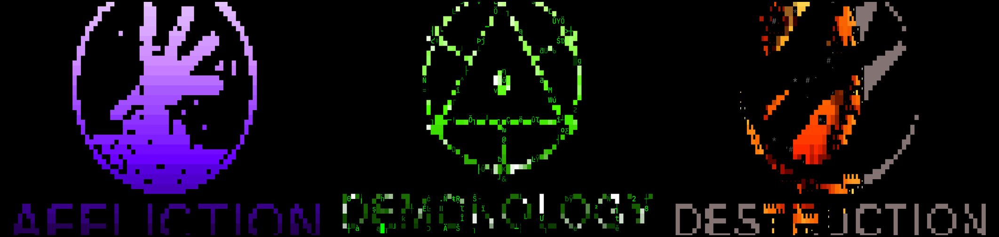
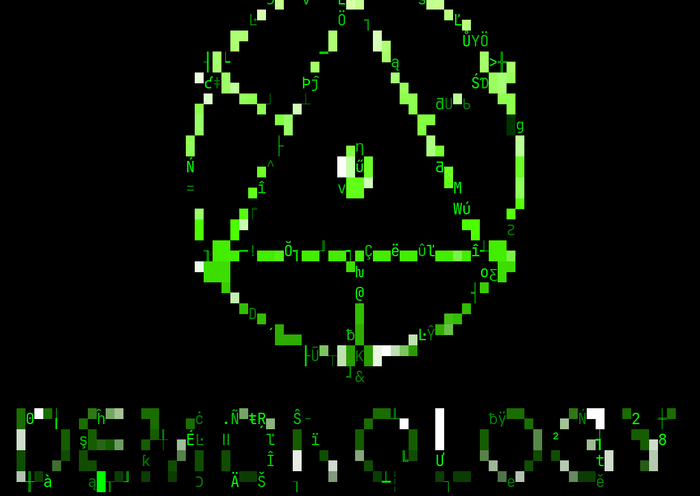
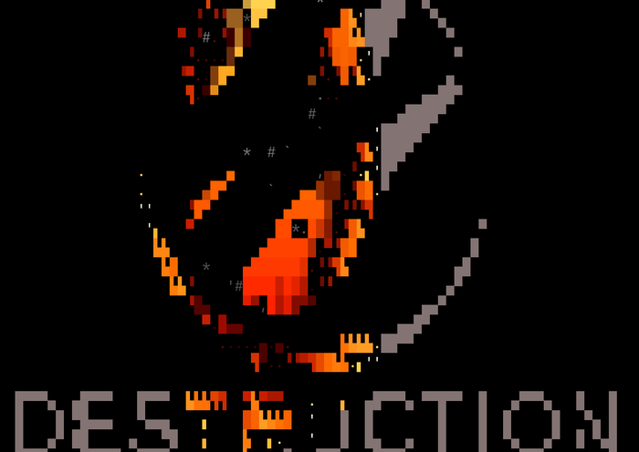
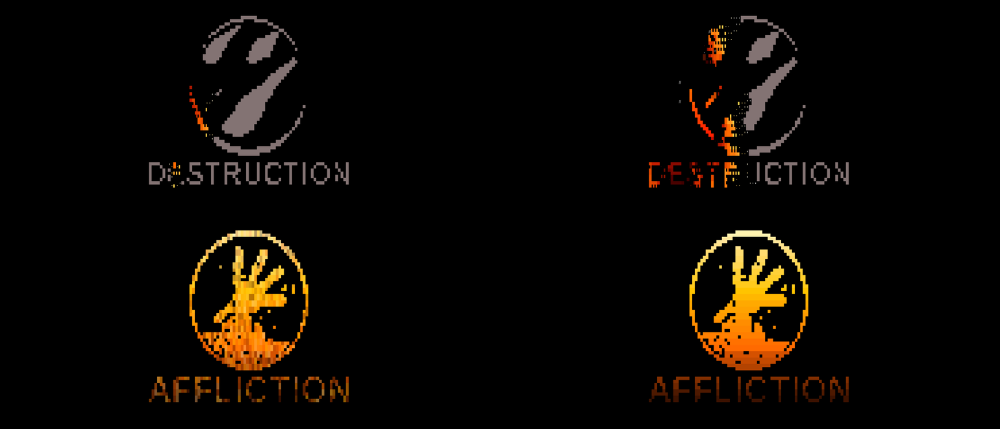

# omarchy-screensavers-warlock

Warlock-themed screensaver pack for [Omarchy](https://omarchy.org/), plus the small
tooling that turns Omarchy's single screensaver into switchable **sets** of
art + effects + colour gradients.



Stock Omarchy draws one ASCII logo (`~/.config/omarchy/branding/screensaver.txt`)
with a random [ttfx](https://github.com/ChrisBuilds/terminaltexteffects) effect. This
pack adds:

- **Sets** — a directory of art files, an effect list and a gradient list you can
  switch between (`screensaver-set set warlock`, `screensaver-set next`).
- **Multiple arts per set** — the warlock set rotates the Affliction, Demonology and
  Destruction sigils; a new one is drawn for every animation.
- **Per-effect tuning** — each effect line carries its own ttfx options, so the
  animations are fast and the fire effects burn in as pixel embers.
- **Colour gradients** — six palettes (ember, felfire, fel, shadow, spectral, void)
  picked at random per animation and fed to ttfx `--final-gradient-stops`.
- **Authoring tools** — `screensaver-dev` converts images to pixel art, renders art to
  PNG, sweeps threshold/mode variants into a labelled montage, and screenshots the
  live screensaver so you can iterate without guessing.

| Affliction | Demonology | Destruction |
|---|---|---|
|  |  |  |

Fire is part of the animation, not an overlay — `burn` ignites the sigil pixel by
pixel and `spray --spray-position s` throws embers up from the bottom of the screen:



## Requirements

- Omarchy 4.x (tested on 4.0.4) with Hyprland
- `ttfx` (ships with Omarchy's screensaver)
- `magick` (ImageMagick) and `grim` — only for the authoring tools

## Install

```sh
git clone https://github.com/ethereumdegen/omarchy-screensavers-warlock
cd omarchy-screensavers-warlock
./install.sh --with-menu
```

The installer:

1. copies `bin/*` into `~/.config/omarchy/bin`
2. copies `sets/*` into `~/.config/omarchy/screensaver-sets` (existing sets are kept
   unless you pass `--force`), and creates an `omarchy` set that restores the stock look
3. puts `~/.config/omarchy/bin` first on `PATH` via `~/.config/uwsm/env.d/50-omarchy-bin.sh`
   (session) and a marked block in `~/.bashrc` (login shells), and applies it to the
   running Hyprland session so no re-login is needed
4. optionally adds a **Style → Screensaver → Set** submenu (`--with-menu`)
5. activates the warlock set

Nothing under `/usr/share/omarchy` is touched. `./uninstall.sh` reverses all of it
(`--purge` also deletes the sets).

## Use

```sh
screensaver-set                  # active set
screensaver-set list             # installed sets
screensaver-set set warlock      # switch
screensaver-set next             # cycle
screensaver-set show             # art, effects, palettes, sample ttfx argv
screensaver-set preview          # start the screensaver right now
screensaver-set effects          # edit the active set's effect list
screensaver-set palettes warlock # edit its gradients
```

The idle screensaver (Omarchy shell, `idle.screensaver` in `~/.config/omarchy/shell.json`,
150s by default) and the menu's Screensaver entry both pick up the active set, because
`~/.config/omarchy/bin/omarchy-screensaver` shadows the packaged runner on `PATH`.

## How a set is laid out

```
~/.config/omarchy/screensaver-sets/warlock/
├── art/                 one .txt per logo, drawn at random (or a single art.txt)
│   ├── affliction.txt
│   ├── demonology.txt
│   └── destruction.txt
├── effects              "<ttfx effect> [ttfx args...]" per line, blank file = all effects
└── palettes             "<name>: <colors...>" per line, used as --final-gradient-stops
```

`effects` lines are passed straight to ttfx, so anything in `ttfx <effect> --help`
works — this is where speed lives:

```
burn --smoke-chance 0.25 --burn-colors ffffff ffd34d ff6b00 c81e00 3a0000
spray --spray-position s --spray-volume 0.04 --movement-speed-range 1.8-3.6
matrix --rain-time 1.5 --resolve-delay 1 --rain-color-gradient ff9d00 ff3b00 5a0d00
decrypt --typing-speed 10
```

An empty `effects` file means ttfx chooses from its whole catalogue (stock behaviour);
per-effect options and palettes are not available in that mode.

## Making your own art

```sh
# 1. clean the source up: crop, and black out everything outside the disc
screensaver-dev prep logo.jpg /tmp/logo.png --crop 330x330+58+58 --circle

# 2. see every threshold/mode/polarity variant side by side, then pick one
screensaver-dev sweep /tmp/logo.png /tmp/sweep.png

# 3. transcode with the winning settings, add a block-letter caption, stack them
screensaver-dev from-image /tmp/logo.png sigil.txt --threshold 40 --invert --width 46 --height 22
screensaver-dev text AFFLICTION caption.txt
screensaver-dev compose ~/.config/omarchy/screensaver-sets/warlock/art/affliction.txt sigil.txt caption.txt

# 4. look at it as a terminal would render it, then on the real screen
screensaver-dev view ~/.config/omarchy/screensaver-sets/warlock/art/affliction.txt
screensaver-dev shot --set warlock --effect "burn" --palette ember --at 1 --at 3
```

`shot` spawns the real screensaver window through Hyprland and `grim`s it at the given
offsets, which is the only reliable way to judge speed and colour.

Keep art within about 80 columns and 32 rows so it fits a fullscreen terminal at the
screensaver font size.

## Notes

- Art is hand-derived pixel art traced from World of Warcraft warlock specialization
  iconography. World of Warcraft is a trademark of Blizzard Entertainment; this is an
  unaffiliated fan pack.
- Code is MIT licensed. `bin/omarchy-screensaver` is a fork of Omarchy's own
  screensaver script (MIT) with set resolution added.
